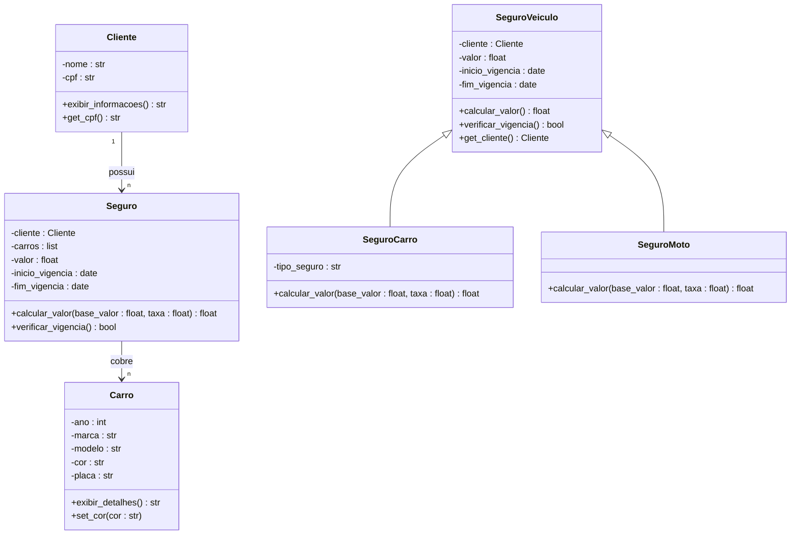

# Diagrama UML - Projeto 2

## Estrutura das Classes

## Explicação Geral

- **Cliente**: armazena informações pessoais com CPF encapsulado.
- **Carro**: representa o veículo, permitindo alteração de cor via método público.
- **Seguro**: gerencia cliente e lista de carros segurados.
- **SeguroVeiculo**: classe base para seguros de veículos.
- **SeguroCarro / SeguroMoto**: especializações de SeguroVeiculo com cálculo de valor próprio.
- **Encapsulamento**: protege dados sensíveis (CPF, atributos do carro).
- **Herança**: permite especialização de tipos de seguro.
- **Composição**: Seguro depende de Cliente e Carro.

## Autor

**William Axel**  
Disciplina: Programação Orientada a Objetos  
Projeto 2 — Sistema de Seguros em Python
